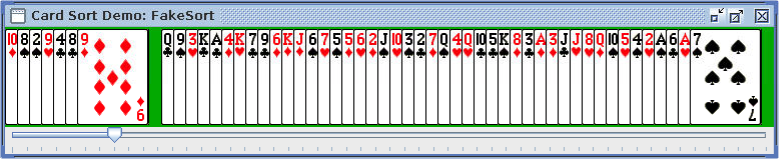

# Assignment 7: Card Sorting

In this assignment, we'll combine what we know about `LinkedLists` with our recent exploration of sorting algorithms to implement an **animated playing-card sorter**. As we've seen, nearly anything that can be done using an `Array` can also be done using a `LinkedList` -- sometimes more easily and sometimes less so. This week you will implement several sorting algorithms on `LinkedLists` to complement our exploration of how to implement them with `Arrays` in Lecture 20.


For full credit, you will implement **all four** of the following:

 - [Insertion Sort](https://en.wikipedia.org/wiki/Insertion_sort)
 - [Selection Sort](https://en.wikipedia.org/wiki/Selection_sort)
 - [Merge Sort](https://en.wikipedia.org/wiki/Merge_sort)
 - [Quicksort](https://en.wikipedia.org/wiki/Quicksort)

Note that the Wikipedia articles linked above focus on the *array* versions of the algorithms, whereas we will be implementing them using a linked list.

Additionally, you have probably noticed that sorting algorithms vary in their efficiency. In the final part of this assignment, you will test your implementations on lists of varying lengths to see how the sorting time changes. You will be asked to reflect on how your results compare to the theoretical computational complexity of different algorithms.

---
### 🚧 Heads up! 🚧
We will be using the Java [`LinkedList` implementation](https://docs.oracle.com/javase/7/docs/api/java/util/LinkedList.html) (which includes some methods with array-like behavior, [such as `get(int index)`](https://docs.oracle.com/javase/7/docs/api/java/util/LinkedList.html#get(int))) rather than your custom implementation from A3. For full credit, be sure to **avoid the use of any methods that involve traversal across the list**, including index-based methods and also ones that require searching for a particular element. These undermine the efficiency of a list-based approach!
---
# File List
Once again, there are a lot of classes included with this assignment, but you will not need to modify all of them.

You will not need to change these classes:
- `Card` describes a single card (e.g., Four of Hearts). It is analagous to an individual `Node` within a linked list
- `CardPile` implements a collection of cards. This class is an implementation of a `LinkedList` itself, providing a collection of `Nodes`
- `SortRecorder` is a tool to allow you to track each step of your 
- `FakeSort` is a fake sorting algorithm that doesn't do much, but it shows you the general structure of how to implement an algorithm that sorts `Cards` within a `CardPile`
- `SortRecorder` is a “listener” class that will keep track of changes in your `CardPile` as your sorting algorithm progresses. This will allow you to visualize how things change as you sort the deck. You can see how to use it in `FakeSort`
- `FakeSortTimer` demonstrates how to time your sorting algorithms to compare their performance

The other classes (`InsertionSort`, `SelectionSort`, `MergeSort` and `QuickSort`) are for the algorithms you will implement for this assignment.

# Running a Demo with FakeSort

All of the necessary code to drive the graphical portion of this assignment is provided in `Card.java` and `CardPile.java`. Though you do not need to modify either of these files, feel free to take a look inside to get a sense for how they work.

For our demo, we'll focus on `FakeSort.java`, which contains a visual demonstration of the progression of an ineffective sorting algorithm:



This program doesn't do any actual sorting, it just moves the cards from the "unsorted" area to the "sorted" area one by one, allowing you to watch the algorithm as it progresses step by step.

Before you write any code, run `FakeSort` and move the slider to see how it works. Note: The visualization often takes a beat -- like maybe 30 seconds -- to load.

# Program Specifications

In order to keep things organized, you will write separate classes for each sorting algorithm you implement in files called `InsertionSort.java`,  `SelectionSort.java`, `MergeSort.java`, and `Quicksort.java` respectively. Stubs for these classes have already been provided.

You should add a main method to each class following the outline that you can see in `FakeSort.java`. In each main class, you will:
1. Initialize a deck of cards, shuffle it, and sort it using the expected algorithm. 
2. Create a record of what the program does while it sorts does using the `SortRecorder` class, as shown in the demo. You should create: 
   1. **one snapshot per outer loop iteration** (i.e., as many snapshots as you have cards to sort) in insertion sort and selection sort
   2. **one snapshot per merge operation** in merge sort (i.e., take a snapshot each time you combine two sub-lists of cards). 
   3. For quicksort, create a view of each list both before and after moving the cards to either side of the pivot, and then after the recursive call has returned.

Please note that you can use the `compareTo` method of the `Card` class to compare two cards based on rank-suit. Demo code showing how to use `compareTo` is provided in `FakeSort` (but has been commented out)

# Phase 1: Sorting on LinkedLists

Your programs will use the `CardPile` class (which extends `LinkedList<Card>`)  to store each collection of cards that you want to sort. This strategy of using Java’s built-in LinkedList collection provides some useful functionality, including being able to shuffle the cards by calling `Collections.shuffle(...)` on a `CardPile` (as we do in Line 19 of `Main.java`). You should record these operations using the `SortRecorder` class, as shown in the stub for each algorithm and in `FakeSort.java`.

As we've seen in class, processing a list differs somewhat from processing an array: **insertion** and **deletion** of elements is easy on a list, but hard in an array (because a full array includes no room for insertion, and deletion leaves an empty hole in an otherwise full array). Because of this, the algorithms we developed for sorting on arrays involved lots of _swapping_, because the only way to make room for an element was to move another one out of the way.

With lists, instead of _swapping_ elements to reorder them, the natural approach is to work with **two lists**, removing elements from the `unsorted` list and inserting them into the `sorted` list without disturbing the order of any other items. Note that the unsorted list will begin full and shrink as elements are removed from it, while the sorted list will begin empty and grow until it contains all the elements of the original unsorted list. As mentioned above, if you find yourself swapping values using the `set()` method, you're probably using the lists too much like arrays and failing to take advantage of their strengths.

For reference, below are summaries each of the three sorting algorithms referenced in this assignment as they are implemented on lists:

## SelectionSort
 - Until `unsorted` is empty:
   - Scan `unsorted` for the smallest remaining element.
   - Remove that element from `unsorted` and add it to the tail of `sorted`.

_One way to do this:_ Loop through all the nodes, keeping the `index` of the smallest element seen so far as you continue to scan through the list, then remove that element by `index`.

_Another way:_ Avoid using an index by actually pulling out the smallest element seen so far, and then swapping it back in if and when you encounter a smaller one. 

_Yet another way:_ Use two iterators, one to traverse the loop element by element and the other to hold the place of the smallest element seen so far, so you get a stable sort.

## InsertionSort

- Until `unsorted` is empty:
  - Remove the first element from `unsorted` and find the point where it should go in `sorted` (the point where all previous elements are smaller than the removed element and all following elements are greater than or equal to it).
  - Insert the removed element into `sorted` at this point.
 
## MergeSort

- Begin by placing each element of `unsorted` into its own new singleton `CardPile` and add all those piles to a queue.
- While more than one list remains on the queue:
  - Remove the first two lists from the queue and merge them, preserving their sorted order.
  - Put the result back at the end of the queue.

_To merge two sorted lists into a single sorted list:_
  - Look at the first element in each list.
  - Take the smaller of the two off the front of its old list and put it at the end of a new (merged) list.
  - Repeat this until both one of the old lists is empty, at which point you can append the remainder of the other original list to the new list.
  - If the original lists were sorted, and you always take the smallest element available, then the resulting list will also be sorted. (You might want to convince yourself of this fact before continuing.)

_Note: the **key operation** here is the merging of two sorted lists. Probably you will want to develop a method for this and test it thoroughly before tackling the full program._

## Quicksort

Quicksort on lists is a bit more straightforward than on arrays.  Like MergeSort, it's a recursive algorithm: the stop condition is a list with 0 or 1 elements, which is already sorted and can simply be returned.  For the recursive step, do the following:
 * Take the first element as the pivot.  (_Note: This works well unless the list is already sorted, but we'll ignore that detail._)
 * Pull the remaining elements off the list one at a time and append them to either of two new sublists: one for elements **less than the pivot** and one for elements **greater than or equal to the pivot**.
 * Recursively sort the two sublists, then glue the results back together with the pivot in the middle, and return that as the result.

# Phase 2: Experimentation
Now that you have working (and thoroughly debugged!) implementations of each of the algorithms above, we are ready do some empirical investigation of differences in their running times. To do this, we will need to make four new classes, `InsertionSortTimer.java`, `SelectionSortTimer.java`, `MergeSortTimer.java`, and `QuicksortTimer.java`. You will use these classes to sort large `CardPiles` of different sizes, as described below, so that you can see for yourself how they compare for speed.

In each of these new classes, make a variant of each of your sorting algorithms that removes all references to `SortRecorder`, following the demo contained in `FakeSortTimer.java`. This should **not** require a major overhaul of the code doing the actual sorting work, and you can copy the `main(...)` method verbatim.

(_Note: Eliminating the recording is necessary because recording takes up both time and memory, which gets in the way of measuring the time required for the sorting itself. Make sure you disable any debugging printouts as well._)

## Using the Unix `time` command

You can time a program on unix-based systems (like the one driving repl.it) by preceding the call to run it with `time`, for example:

```time java MergeSortTimer 10000```

(Note: if you are using PowerShell, you will need to look up `Measure-Command` instead.)

This command will print out a rather cryptic result, with timing numbers in different orders depending on the system. `real` gives the actual time elapsed. `user` gives the time spent running the program by the CPU, which is the number you are most interested in. `sys` gives the amount of time spent in system calls. If you're running your code on your own computer, the information provided may be somewhat different, but you should still be able to figure out which number is the CPU time.

Alternatively, you may use the `Timer` class from the last homework to record the program’s runtime.

Please run a sort using each of your implemented algorithms on inputs that double progressively in size: 10000 cards, 20000 cards, 40000 cards, etc. Continue until you see a clear difference in speed, or until one method is unable to finish in a reasonable time (say a few minutes). You may also want to test them out on various kinds of inputs: random order, already sorted, sorted in reverse.

Do your experiments match your expectations? When you're done, write up a short summary of your findings to include in your `readme.md`.